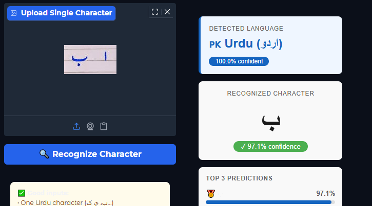
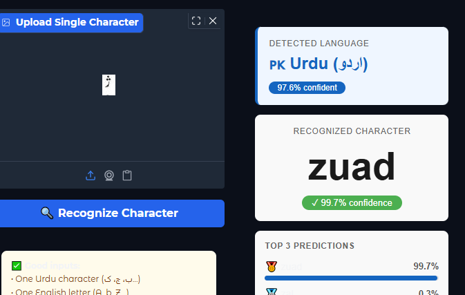
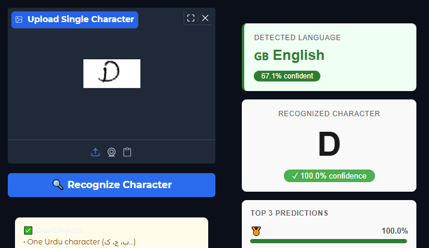
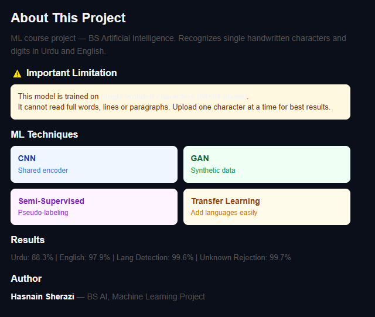

# Urdu-English Handwritten Recognition

A multilingual handwriting recognition system that classifies handwritten **Urdu** and **English** characters, automatically detects which language a character belongs to, and rejects unsupported scripts (Arabic, Chinese, Hindi) instead of guessing.


## Demo

| Urdu character recognition | Text-level detection |
|---|---|
|  |  |

| English character recognition | Unknown-script rejection |
|---|---|
|  |  |

Run it yourself in under a minute — see [Running locally](#running-locally) below.

---

## Overview

Urdu handwriting recognition is underexplored compared to English, mainly because of the cursive Nastaliq script and a scarcity of labeled data. This project addresses that with:

- A **shared CNN encoder** with language-specific classification heads (inspired by multilingual NLP models like mBERT, applied here to visual character recognition)
- A **Conditional GAN** to generate synthetic Urdu training samples and offset the 1:9 Urdu-to-English data imbalance
- **Semi-supervised learning** (confidence-thresholded pseudo-labeling) to squeeze extra accuracy out of unlabeled data
- An explicit **"Unknown" language class**, trained on Arabic, Chinese, and Hindi samples, so the model can genuinely refuse predictions instead of forcing a wrong guess
- A **frozen-encoder extension mechanism** — new languages can be added later with just a new lightweight head, no full retraining

Trained on **582,089 images across 7 datasets**, with a Gradio app for interactive inference (see [Demo](#demo) above).

## Results

| Task | Accuracy |
|---|---|
| Urdu character recognition | **88.31%** |
| English character recognition | **97.91%** |
| Language detection (Urdu / English / Unknown) | **99.60%** |
| Unknown script rejection | **99.67%** |

**Impact of GAN + semi-supervised training:** Urdu accuracy improved from 24% (epoch 1, supervised only) to 88.31% after adding GAN-generated synthetic samples and pseudo-labeled data. Language detection improved from 68.86% to 99.60% (+30.7 points) after adding the explicit Unknown class and correcting class imbalance.

## Architecture

```
Input image (64×64 grayscale)
        │
        ▼
 SharedEncoder (CNN, 1.24M params)
   4 conv blocks → 256-d feature vector
        │
   ┌────┴────┬─────────────┐
   ▼         ▼              ▼
CharHead   CharHead      LangHead
(Urdu,     (English,     (Urdu / English /
90 classes) 62 classes)   Unknown)
```

- **Encoder**: 4 convolutional blocks (32→64→128→256 channels) with BatchNorm, ReLU, MaxPool, Dropout, ending in adaptive average pooling and a projection to a 256-dim feature space
- **Character heads**: lightweight 2-layer MLPs per language, trained on top of the shared, freezable encoder
- **Language head**: 3-layer MLP for language classification / unknown-script rejection
- Total model size: **1.42M parameters**

## Datasets

7 datasets, ~582K images total: UHaT Urdu Handwriting Dataset, Urdu 120K, IAM Handwriting Database and an English A-Z/0-9 character set, plus Arabic, Chinese, and Hindi samples used to train the Unknown class.

## Tech stack

Python · PyTorch · Gradio · OpenCV · Conditional GAN · Kaggle (training)

## Project structure

```
├── app.py                                     # Gradio inference app
├── config.json                                # Class labels + model config
├── model.pt                                   # Trained model weights
├── requirements.txt
├── notebooks/
       └── ml-project-handwritten-language-detection.ipynb   # Full training pipeline
           (EDA → preprocessing → GAN → training → eval)
├── assets/                     # Demo screenshots used in this README
       └── README.md
       └── demo_english_char.png
       └── demo_text_detection.png
       └── demo_unknown_rejection.png
       └── demo_urdu_char.png
```

## Running locally

```bash
git clone https://github.com/SyedKashaaf/Urdu-English-Handwritten-Recognition.git
cd Urdu-English-Handwritten-Recognition
pip install -r requirements.txt
python app.py
```

This launches a local Gradio interface where you can upload a handwritten character image and get a live prediction with confidence scores.

## Future work

- Full word/line recognition via a CTC-based sequence model (CRNN or Transformer), moving beyond isolated characters
- Additional languages (Arabic, Persian, Hindi) using the existing incremental-learning mechanism
- Confidence calibration (temperature scaling)
- On-device deployment via TensorFlow Lite / ONNX
- Real-time camera-based recognition

## Author

**Syed Kashaaf Haider** — BS Artificial Intelligence, Capital University of Science and Technology (CUST), Islamabad
[GitHub](https://github.com/SyedKashaaf) · [LinkedIn](https://linkedin.com/in/syedkashaaf)

## License

MIT
